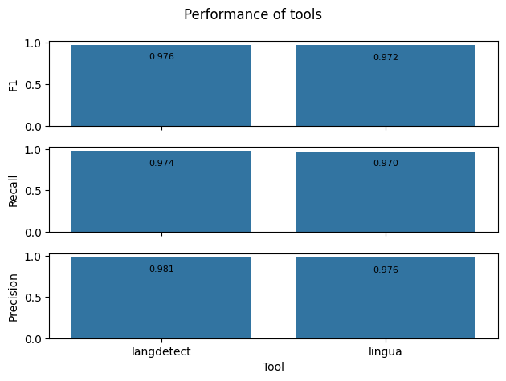
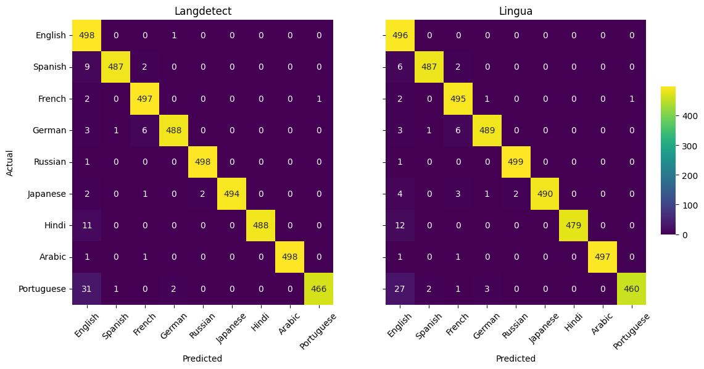
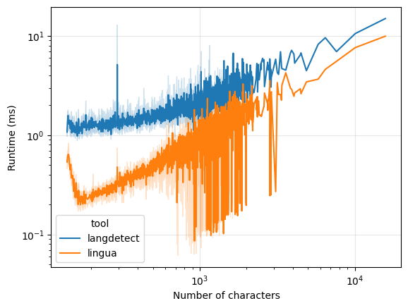
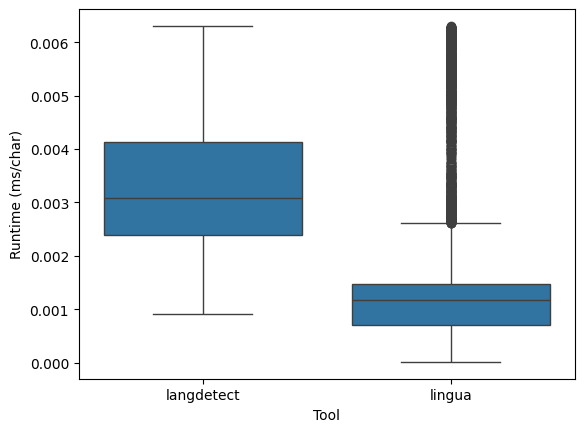

# Language Identification Tool Proposal

## Use Case

most propably preprocessing purposes; can be used as a part of choice of agent in LLM based system; should be fast and accurate

## Benchmark

WiLI-2018 benchmark dataset for monolingual written natural language identification; short text extracts from Wikipedia; It contains 1000 paragraphs of 235 languages, totaling in 235 000 paragraphs. The dataset was cut down to 49 languages that are in common between tested tools.

## Tools Comparision

| Tool           | Pros                                                                                                               | Cons                |
| -------------- | ------------------------------------------------------------------------------------------------------------------ | ------------------- |
| **langdetect** | - Easy to use   - Supports 55 languages                                                                         | - Very slow         |
| **lingua-py**  | - Well documented usage   - Easy to use   - Fast   - Supports 52 languages   - Supports multithreading | - High memory usage |

> Accuracy of all tools on the benchmark dataset. The performance of the tools has been measured only on the 49 languages that are in common between them. Langdetect tends to achieve better performance on WiLi-2018. The difference in accuracy between the tools is not significant.

> Both tools performed well on the most popular languages in the dataset. Identification of Portuguese, Hindi, and Spanish was the most challanging for both tools and those were missclassified as English the most.

> Lingua-py is significantly faster than langdetect for all text lengths. The difference in runtime between the tools is the most significant for short texts.

## Conclusion

Both tools are suitable for language identification tasks. Langdetect is more accurate but significantly slower than lingua-py on the WiLi-2018 dataset. Lingua-py is faster and uses less memory than langdetect. The difference in accuracy between the tools is not significant. Lingua-py is a better choice for applications that require fast language identification.

The tools performed well but to choose the best one more tests and research should be done. The test should be done with other datasets as well (ex. LiD201, VOXLINGUA107, DSL-TL). The proposed tools was chosen because of the availability and the ease of use, but there are other tools that could be tested as well (ex. CLD2, CLD3, Langid, FastText, FastSpell, Simplemma, Polyglot, TextBlob). If the performance of the tools is not satisfying for the specific use case, the custom text classification model should be trained. Promising results can be achieved with the use of language models combined with statistical methods as ensemble approache.
